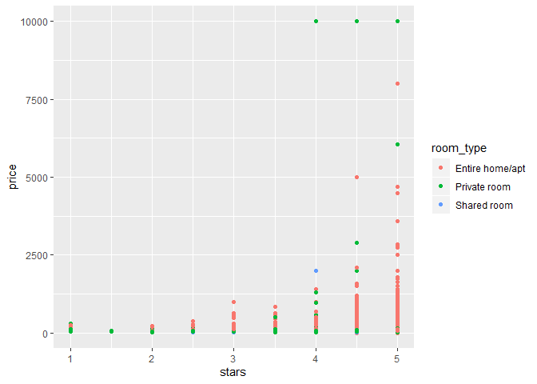
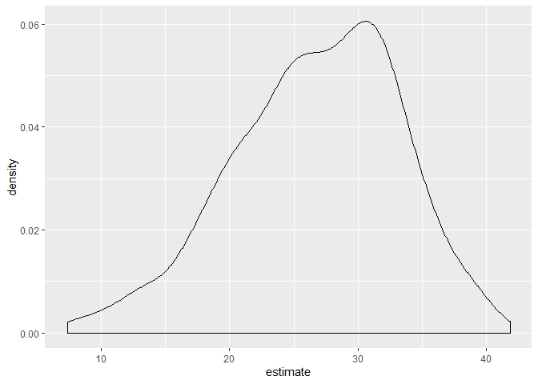

bootstrapping
================
Hana Akbarnejad
11/14/2019

``` r
n_samp = 250

sim_df_const = 
  tibble(
    x = rnorm(n_samp, 1, 1),
    error = rnorm(n_samp, 0, 1),
    y = 2 + 3 * x + error
  )

sim_df_nonconst = sim_df_const %>% 
  mutate(
  error = error * .75 * x,
  y = 2 + 3 * x + error
)

sim_df = 
  bind_rows(const = sim_df_const, nonconst = sim_df_nonconst, .id = "data_source") 

sim_df %>% 
  ggplot(aes(x = x, y = y)) + 
  geom_point(alpha = .5) +
  stat_smooth(method = "lm") +
  facet_grid(~data_source)
```

<!-- --> In the
plot on right we have non-constant variance (different variability in
the start and ending of the line and data scattering\!)

Fit two models:

``` r
sim_df_const %>% 
  lm(y ~x, data = .) %>% 
  broom::tidy()
```

    ## # A tibble: 2 x 5
    ##   term        estimate std.error statistic   p.value
    ##   <chr>          <dbl>     <dbl>     <dbl>     <dbl>
    ## 1 (Intercept)     1.98    0.0981      20.2 3.65e- 54
    ## 2 x               3.04    0.0699      43.5 3.84e-118

``` r
sim_df_nonconst %>% 
  lm(y ~x, data = .) %>% 
  broom::tidy()
```

    ## # A tibble: 2 x 5
    ##   term        estimate std.error statistic   p.value
    ##   <chr>          <dbl>     <dbl>     <dbl>     <dbl>
    ## 1 (Intercept)     1.93    0.105       18.5 1.88e- 48
    ## 2 x               3.11    0.0747      41.7 5.76e-114

This is wrong\! variability should be higher than this in nonconstant\!
Can we do some bootsrapping to fix this result?\! (happens because R has
some assumptions which are not always true)

# Boostrapping code:

write a function to draw bootsrap sample baed on the df:

``` r
boot_sample = function(df) {
  sample_frac(df, replace = TRUE)
}
```

visualizing:

``` r
boot_sample(sim_df_nonconst) %>% 
  ggplot(aes(x = x, y = y)) + 
  geom_point(alpha = .5) +
  stat_smooth(method = "lm")
```

<!-- -->

Now we want to analyze many bootsrap samples instead of one\!

``` r
boot_straps = 
  data_frame(
    strap_number = 1:1000,
    strap_sample = rerun(1000, boot_sample(sim_df_nonconst))
  )
```

    ## Warning: `data_frame()` is deprecated, use `tibble()`.
    ## This warning is displayed once per session.

Do some kind of analysis:

``` r
bootstrap_results = 
  boot_straps %>% 
  mutate(
    models = map(strap_sample, ~lm(y~x, data = .x)),
    results = map (models, broom::tidy)
  ) %>% 
  select (- strap_sample, -models) %>% 
  unnest(results)
```

summarize results:

``` r
bootstrap_results %>% 
  group_by(term) %>% 
  summarize(se = sd(estimate))
```

    ## # A tibble: 2 x 2
    ##   term            se
    ##   <chr>        <dbl>
    ## 1 (Intercept) 0.0747
    ## 2 x           0.101

These results are different from what we got previousely from
nonconstant sample\!

Trying ‘modelr’ package: (doesnt require sample fraction and stuff\!)
how to generate bootsrap sample is the only thing which is different
from bootsrap function. the rest of the process is exactly the same.

``` r
boot_straps = 
  sim_df_nonconst %>% 
  modelr::bootstrap(1000)
```

## what if your assumptions aren’t wrong?

bootsrap will give us the same result\!

``` r
sim_df_const %>% 
  modelr::bootstrap(n = 1000) %>% 
  mutate(models = map(strap, ~lm(y ~ x, data = .x) ),
         results = map(models, broom::tidy)) %>% 
  select(-strap, -models) %>% 
  unnest(results) %>% 
  group_by(term) %>% 
  summarize(boot_se = sd(estimate))
```

    ## # A tibble: 2 x 2
    ##   term        boot_se
    ##   <chr>         <dbl>
    ## 1 (Intercept)  0.0985
    ## 2 x            0.0697

# An example of when things don’t work the way we expect them to:

``` r
data("nyc_airbnb")

nyc_airbnb = 
  nyc_airbnb %>% 
  mutate(stars = review_scores_location / 2) %>% 
  rename(
    boro = neighbourhood_group,
    neighborhood = neighbourhood) %>% 
  filter(boro != "Staten Island") %>% 
  select(price, stars, boro, neighborhood, room_type)
```

``` r
nyc_airbnb %>% 
  ggplot(aes(x = stars, y = price, color = room_type)) + 
  geom_point() 
```

    ## Warning: Removed 9962 rows containing missing values (geom_point).

<!-- -->

the relationship between stars and price doesnt work how we expect
because of the extreme outliers we have. So we need a more realistics
approach to see the distribution of slope.

``` r
airbnb_results = nyc_airbnb %>% 
  filter(boro == "Manhattan") %>% 
  modelr::bootstrap(n = 1000) %>% 
  mutate(
    models = map(strap, ~ lm(price ~ stars + room_type, data = .x)),
    results = map(models, broom::tidy)) %>% 
  select(results) %>% 
  unnest(results) 

# make a plot of stars distribution:
airbnb_results %>% 
  filter(term == "stars") %>% 
  ggplot(aes(x = estimate)) + geom_density()    # we can see that the plot is skewed!
```

<!-- -->

we can solve this with help of bootsrapping\!
